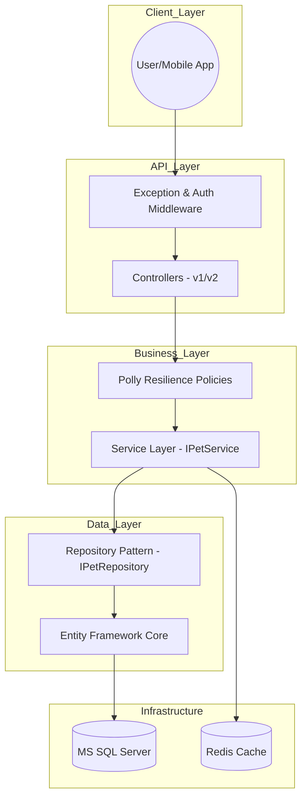

🐾 Pet Health Tracker Pro: Enterprise Edition
This is a high-performance, production-ready .NET 8 Web API built for enterprise-scale pet health management. This project represents a 30-day intensive engineering journey from a basic API to a resilient, cloud-native orchestrated platform.

## 🏗️ Architecture Diagrams



🚀 Key Features
🏗️ 1. Architecture & Design (Sprint 2-3)
Clean Architecture: Strict separation of concerns using Repository and Service patterns.
API Versioning: Full support for versioned endpoints (/api/v1/, /api/v2/) to maintain backward compatibility.
Dependency Injection: Loosely coupled components for better testability and scalability.
Background Processing: Automated background jobs for pet health reminders and vaccination alerts.
🔐 2. Security & Data Integrity
JWT Hardening: Secure authentication with Refresh Token Rotation and Token Revocation (Logout).
Role-Based Access Control (RBAC): Tiered permissions (Admin-only deletion).
Rate Limiting: IP-based and User-based throttling to prevent API abuse.
FluentValidation: Robust server-side validation with standardized API response wrappers.
⚡ 3. Performance & Resilience (Sprint 4)
EF Core Tuning: Optimized queries using AsNoTracking, AsSplitQuery, and Indexing.
Advanced Caching: In-memory and Distributed caching (Redis) with Tag-based Invalidation.
Polly Resilience: Multi-layered fault tolerance including Retry, Circuit Breaker, and Bulkhead Isolation.
True Idempotency: Consistent write operations via X-Idempotency-Key tracking.
🐳 4. DevOps & Cloud (IaC)
Kubernetes Orchestration: Production manifests with Horizontal Pod Autoscaling (HPA) and self-healing Probes.
Infrastructure as Code (IaC): Automated Azure provisioning using Terraform.
CI/CD Pipeline: Fully automated build, test, and deployment via GitHub Actions.
🛠️ Tech Stack
Backend: .NET 8.0 (C#), EF Core
Databases: MS SQL Server, Redis, SQLite
Observability: OpenTelemetry, Jaeger, Serilog
DevOps: Docker, Kubernetes, Terraform, GitHub Actions
Testing: xUnit, Moq, k6 (Load Testing)
📥 Project Structure
code
Text
├── PetHealthAPI/ # Main API Project
│ ├── Controllers/ # API Endpoints (v1, v2)
│ ├── Services/ # Business Logic
│ ├── Repositories/ # Data Access Layer
│ ├── BackgroundServices/ # Workers (Outbox, Reminders)
│ ├── Middleware/ # Custom Exceptions, Tracing
│ └── Data/ # DB Context & Migrations
├── k8s/ # Kubernetes Manifests
├── terraform/ # Infrastructure as Code
├── scripts/ # k6 Performance Scripts
└── PetHealthAPI.Tests/ # Unit & Integration Tests
⚙️ Setup & Installation

1. Standard Local Run
   code
   Bash
   git clone https://github.com/chandrasoodanzenve/PetHealthAPI.git
   dotnet ef database update
   dotnet run
2. Docker Setup (Recommended)
   code
   Bash

# Spins up API, SQL Server, Redis, and Jaeger

docker-compose up --build 3. Orchestration & Cloud
Load Test: k6 run scripts/load-test.js
K8s Deploy: kubectl apply -f k8s/
Terraform: cd terraform && terraform init && terraform apply
📊 Governance & Operational Excellence
SLO Target: 99.9% availability, 95% latency < 500ms.
Audit Logging: 100% of sensitive operations (Post/Put/Delete) are auditable with user context.
Monitoring: Real-time metrics and traces available via Jaeger UI (Port 16686) and Grafana.
````
