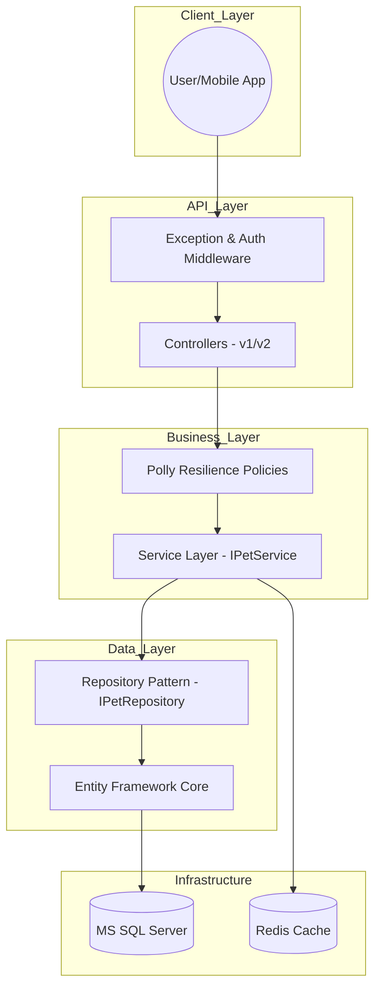
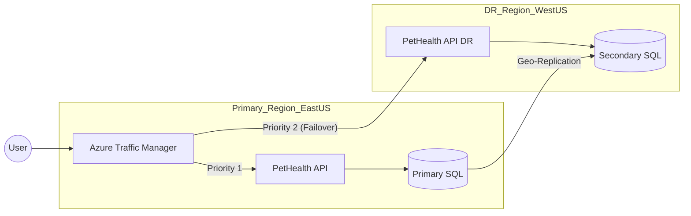

 Pet Health Tracker Pro: Enterprise Edition
This is a high-performance, production-ready .NET 8 Web API built for enterprise-scale pet health management. This project represents a 30-day intensive engineering journey from a basic API to a resilient, cloud-native orchestrated platform.

##  Architecture Diagrams





##  Key Features

###  1. Architecture & Design (Sprint 2-3)

- **Clean Architecture:** Strict separation of concerns using Repository and Service patterns.
- **API Versioning:** Full support for versioned endpoints (`/api/v1/`, `/api/v2/`).
- **Dependency Injection:** Loosely coupled components for better testability.
- **Background Processing:** Automated jobs for pet health reminders and vaccination alerts.

###  2. Security & Data Integrity

- **JWT Hardening:** Secure authentication with Refresh Token Rotation and Revocation.
- **Role-Based Access Control (RBAC):** Tiered permissions (Admin-only deletion).
- **Rate Limiting:** IP-based and User-based throttling to prevent API abuse.
- **FluentValidation:** Robust server-side validation with standardized responses.

###  3. Performance & Resilience (Sprint 4)

- **EF Core Tuning:** Optimized queries using AsNoTracking, Split Queries, and Indexing.
- **Advanced Caching:** In-memory and Distributed caching (Redis) with Tag-based Invalidation.
- **Polly Resilience:** Multi-layered fault tolerance (Retry, Circuit Breaker, Bulkhead).
- **True Idempotency:** Consistent write operations via `X-Idempotency-Key` tracking.

###  4. DevOps & Cloud (IaC)

- **Kubernetes Orchestration:** Production manifests with Auto-scaling (HPA) and Probes.
- **Infrastructure as Code (IaC):** Automated Azure provisioning using Terraform.
- **CI/CD Pipeline:** Fully automated build, test, and deployment via GitHub Actions.

##  Tech Stack

- **Backend:** .NET 8.0 (C#), Entity Framework Core
- **Databases:** MS SQL Server, Redis, SQLite
- **Observability:** OpenTelemetry, Jaeger, Serilog
- **DevOps:** Docker, Kubernetes, Terraform, GitHub Actions

##  Customer Intelligence 

- **Unified Layer**: Consolidates Behavioral (Logs) and Business (SQL) signals.
- **Conflict Resolution**: Logic implemented to resolve mismatches between app usage and pet health.
- **Documentation**: Detailed frameworks available in the `/analytics` directory.

##  Project Structure

```text
├── PetHealthAPI/           # Main API Project
│   ├── Controllers/        # API Endpoints (v1, v2)
│   ├── Services/           # Business Logic
│   ├── Repositories/       # Data Access Layer
│   ├── BackgroundServices/ # Workers (Outbox, Reminders)
│   └── Data/               # DB Context & Migrations
├── k8s/                    # Kubernetes Manifests
├── terraform/              # Infrastructure as Code
└── PetHealthAPI.Tests/     # Unit & Integration Tests
 Setup & Installation
1. Standard Local Run
code
Bash
git clone https://github.com/chandrasoodanzenve/PetHealthAPI.git
dotnet ef database update
dotnet run
2. Docker Setup
code
Bash
docker-compose up --build
 Operational Excellence
SLO Target: 99.9% availability, 95% latency < 500ms.
Audit Logging: 100% of sensitive operations are auditable with user context.
Monitoring: Real-time metrics and traces available via Jaeger UI (Port 16686).s

##  Executive Summary & Benchmarks

- **P95 Latency**: < 200ms for read operations.
- **Compliance**: 100% RBAC and Audit logging coverage.
- **Reliability**: Validated Disaster Recovery with 15-min RPO.

```
