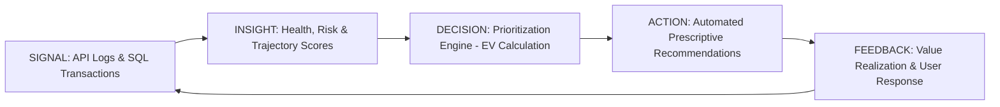

#  Enterprise Product Intelligence Operating Model

## 1. Consolidated Intelligence Ecosystem (Days 1–34 Integration)

This operating model consolidates every system built during the 35-day engineering cycle into a unified enterprise platform:

- **Foundational Data Layer (Days 1–15)**: Clean Architecture, Repository Pattern, and High-Performance SQL/Redis storage providing the "Source of Truth."
- **Observability & Diagnostics Layer (Days 21–25 & 31)**: OpenTelemetry and Performance Intelligence providing real-time technical and process signals.
- **Resilience & Reliability Layer (Days 26–28)**: Polly Policies, Saga Orchestration, and Outbox messaging ensuring data integrity during distributed transactions.
- **Intelligence & Analytics Layer (Days 32–34)**: Behavioral Cohorts, Growth Prioritization, and Prescriptive Recommendation Engine driving business outcomes.

## 2. Integrated Operating Workflow (Data-to-Value Loop)

Our model follows a continuous "Closed-Loop" workflow to translate raw technical signals into business value:

## 3. Analytics Center of Excellence (CoE) Governance

Building upon the Day 30 CoE Framework, the operating model is governed by a centralized hub:
Standardization: CoE defines the global standards for "Health Scores" and "Churn Risk."
Logic Recalibration: CoE reviews and updates RICE-R prioritization weights every 90 days.
Cross-Functional Sync: Acts as the bridge between Engineering, Product, and Customer Success.

## 4. Intelligence Ownership Structure

To ensure accountability, ownership is distributed across the following enterprise teams:
Business Function Ownership Area Key Accountability
Data Engineering Signal Integrity Pipeline reliability, Telemetry accuracy, and Latency (P95/P99).
Data Science Predictive Modeling Accuracy of Cohort Trajectories and Churn Risk scoring.
Product Operations Decision Strategy Management of Insight-to-Action rules and Opportunity Sizing.
Customer Success Value Realization Execution of recommended actions and capturing user feedback.
Executive Leadership Strategic Alignment Quarterly review of ROI and Error Budgets.

## 5. Operating Standards & Compliance

Anonymization: All behavioral signals are masked to protect PII.
Auditability: 100% of automated decisions are logged in the Audit Sink with Trace IDs.
Consistency: Centralized variable management via Terraform IaC for cross-environment parity.

